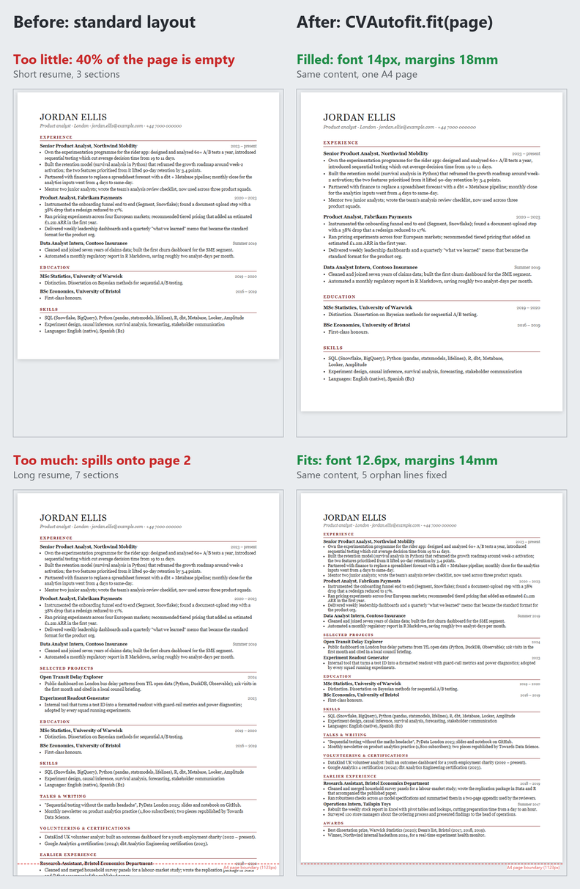
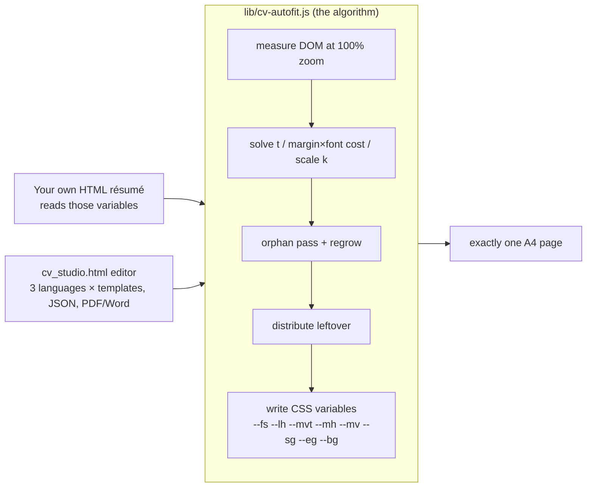
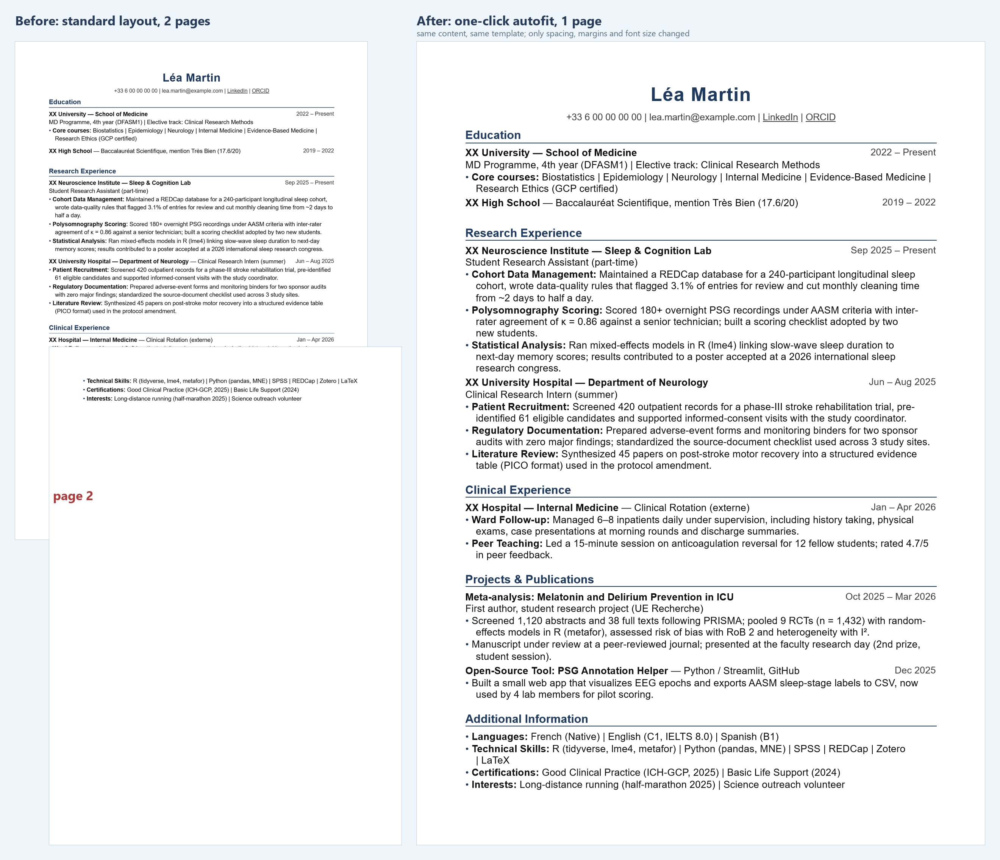
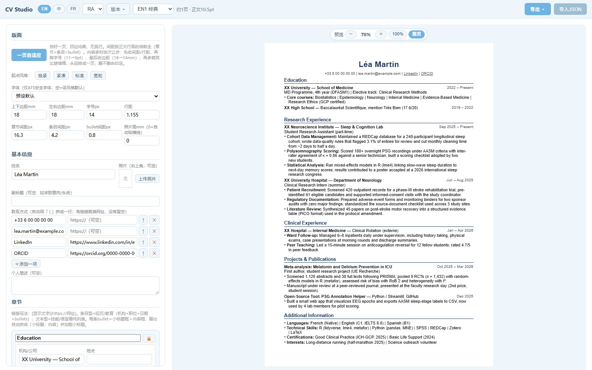
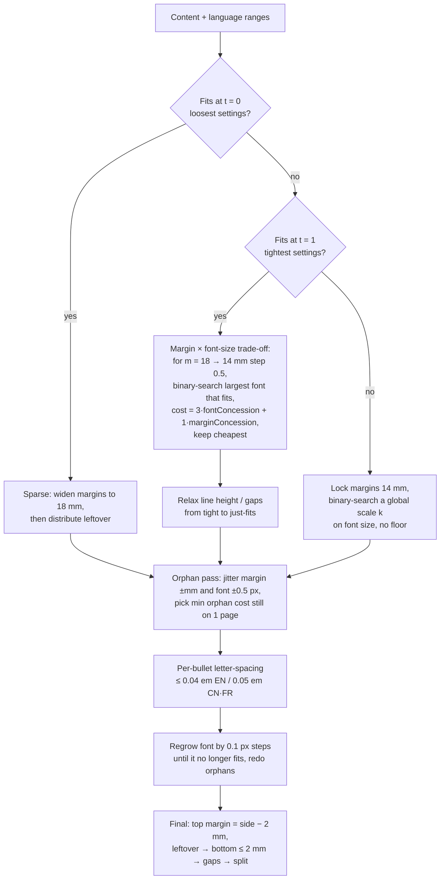
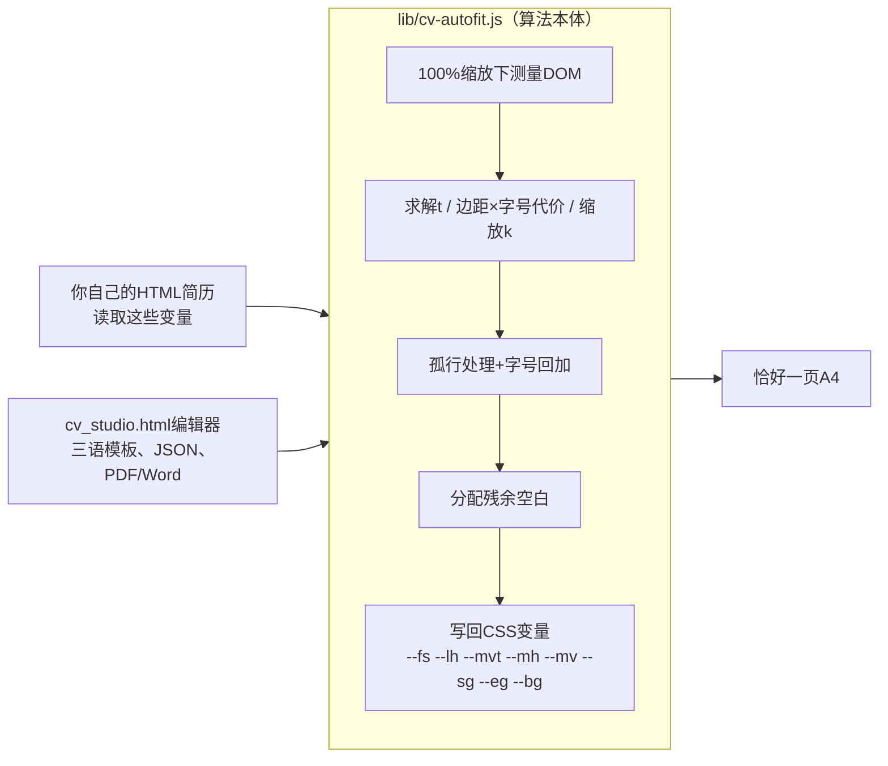
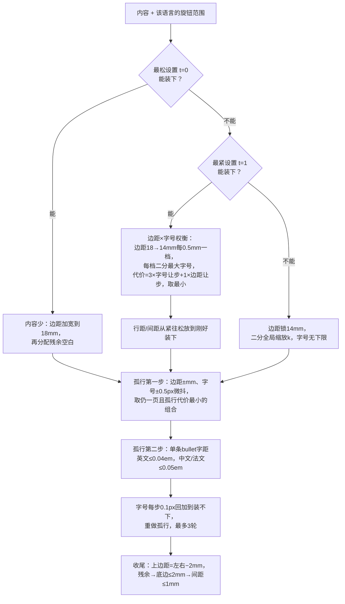

<div align="center">

# cv-autofit

**Any HTML résumé, exactly one A4 page.**<br>
Font size, margins and spacing solved together; no words cut, no empty half-page.

[English](#english) · [中文](#中文) · [Demo page](demo/index.html) · [Editor](cv_studio.html)



</div>

| | What | For whom |
|---|---|---|
| **`lib/cv-autofit.js`** | 13 KB, zero-dependency library. Two lines in your own HTML résumé. | You already have an HTML/CSS résumé and want it to fit one page. |
| **`cv_studio.html`** | Complete single-file résumé editor built on the library (EN / 中 / FR, PDF & Word export). | You want a ready-made tool; nothing to install, nothing uploaded. |

---

## English

### How the pieces fit



### The library: `lib/cv-autofit.js`

You already have an HTML résumé (JSON Resume theme, a LaTeX-to-HTML export, your own hand-written page). It runs a few lines long, or leaves a lonely third of a page empty. Two lines fix that:

```html
<script src="cv-autofit.js"></script>
<script>
  var r = CVAutofit.fit(document.querySelector('.page'), { lang: 'en' });   // 'en' | 'cn' | 'fr'
  document.getElementById('print').textContent = CVAutofit.pageCSS(r);       // optional: matching @page margins for PDF
</script>
```

The only contract is that your CSS reads its knobs from these variables (names configurable via `opts.vars`):

```css
.page { width: 210mm; padding: var(--mvt) var(--mh) var(--mv); font-size: var(--fs); line-height: var(--lh); }
.page h2 { margin: var(--sg) 0 calc(var(--sg) * .35); }   /* section gap  */
.page ul { margin: .15em 0 var(--eg); }                     /* entry gap    */
.page li { margin-bottom: var(--bg); }                      /* bullet gap   */
```

`fit()` returns `{fs, lh, mv, mh, mvt, sg, eg, bg, ols, pages, fallback, sparse, fitlog}`. Options worth knowing: `pages` (default 1), `pageHeight` (1123 px = A4 at 96 dpi), `range` (override the per-language knob ranges), `bullets` (selector for orphan handling, default `li`), `zoomEl` (element whose CSS `zoom` must be reset to 1 while measuring), `onApply(L)` (hook after every trial layout). No dependencies, ES5, works from `file://`. UMD, so `require()` works too.

Try it: open [`demo/index.html`](demo/index.html) locally, a serif résumé that looks nothing like the editor's templates, and press *Fit to one page*. Add `?content=short` for the sparse case (40% of the page empty: margins widen, leftover is distributed) or `?content=long` for the overflow case (spills onto page 2: font shrinks, orphan lines are fixed); `&fit=1` fits on load. That is how the image at the top was made.

### The editor: `cv_studio.html`

CV Studio is a résumé editor that lives in **one HTML file** (`cv_studio.html`, ~90 KB, zero dependencies).
Download it, double-click it, and it opens in your browser. Everything you type stays in your browser's `localStorage`; nothing is uploaded anywhere.

Its one real trick is **autofit**: press one button and the page finds the largest font size, the most balanced margins and the most even spacing that still keep your content on **exactly one page**, without cutting a single word.

> The interface is in Chinese. The résumé content it produces can be in English, Chinese or French (3 to 4 templates each).



### Try it in 30 seconds

1. Download [`cv_studio.html`](cv_studio.html) (right-click → *Save link as…*).
2. Double-click it. It opens in Chrome / Edge (Firefox works for editing; PDF output is best from Chromium).
3. Switch language with `EN / 中 / FR`, pick a template, edit on the left, watch the right.
4. Click **一页自适应** (autofit) → **导出 ▾ → PDF · A4分页**.

The bundled sample is a fictional 4th-year medical student applying for a research assistant position; every institution is a placeholder ("XX University"). Replace it with yours or import a JSON export.



### Features

| | |
|---|---|
| **One file, fully offline** | No build step, no CDN, no fonts to install. Runs from `file://`. |
| **One-page autofit** | Margins, font size, line height, section / entry / bullet spacing all solved together (see below). Also removes orphan lines (a bullet whose last line holds just one or two words). |
| **3 languages × several templates** | EN: classic / finance / tech / timeline. 中文: classic / shaded headings / navy rule. FR: classic / minimal / timeline (blue, charcoal). Same data, one click to switch. |
| **Multiple versions per language** | e.g. "RA", "PhD", "Industry", each with its own layout; rename / duplicate / delete. |
| **Export** | PDF (A4 or long page), Word `.doc`, JSON (single version or everything, for moving between computers). Import JSON back. |
| **ATS-safe** | Plain HTML text, standard fonts, no tables or text boxes. Bold labels inside bullets (`Label: text` or `【标签】text`) are rendered automatically. |
| **Photo (optional)** | Top-right photo for Chinese résumés; height snaps to the first section rule; drag to resize. |
| **Privacy** | Data never leaves the browser. Delete the file and clear site data and it is gone. |

### How autofit works

The problem: résumé content is discrete (lines wrap, sections can't be split) but the knobs are continuous (margins, font size, spacing). Naive approaches either shrink the font until it is unreadable or leave a lonely half-page.

CV Studio treats it as a small constrained optimisation, solved in layers. All measurements are taken at 100 % preview zoom, because browser zoom changes where lines wrap and would make the screen disagree with the PDF.



Key design decisions:

1. **One tightness parameter `t ∈ [0,1]` drives every knob**, each inside a per-language range (`FIT_RANGE`). Chinese gets larger fonts and line heights than English or French. Knobs are staged: `t` first tightens line height and gaps (0–0.4), then font size (0.3–0.7), then margins (0.6–1.0), so the cheapest concessions happen first.
2. **Gaps are multiples of the body line height**, not fixed millimetres: section gap 1.0–1.4 lines, entry gap 0.25–0.5, bullet gap 0.05–0.12. When the font changes, the visual hierarchy (section > entry > bullet) is preserved automatically.
3. **Margins vs font size is a weighted trade-off, not a fixed priority.** For every margin candidate from 18 mm down to 14 mm (0.5 mm steps) the largest fitting font is found by binary search; the cost is `3 × fontConcession + 1 × marginConcession`. Result: narrow margins first, shrink text only when 14 mm still isn't enough.
4. **Never refuse, never truncate.** If the tightest settings still overflow, margins lock at 14 mm and font size scales down with no floor (line height floor 1.1 to avoid overlapping glyphs). It is the user's call to cut content.
5. **Sparse content is handled too**: margins widen to 18 mm, then leftover height is given to top/bottom margins (≤ 2 mm), entry gaps (≤ 1 mm), section gaps (≤ 1 mm), and half of what remains moves to the top so the page looks vertically balanced.
6. **Orphan lines** (a wrapped bullet whose last line is under 30 % of the width) are removed in two steps: first a joint jitter of margin (−1.5 … +2.5 mm in 0.25 mm steps) and font size (±0.5 px, invisible to the eye) choosing the lowest orphan cost that still fits; then per-bullet letter-spacing, capped at roughly Word's "condensed 0.5 pt". Anything left is kept as is and the user rewrites the sentence.
7. **Print safety**: a 4 px slack below the page height, because screen and PDF pagination differ by a hair, and a filled-to-the-pixel page would push one line to page 2 in print.
8. **Optical top margin**: top margin = side margin − 2 mm (min 13 mm), because the large name at the top already carries visual whitespace.

The algorithm is deterministic and runs in well under a second on a normal laptop; every step is a DOM measurement (`scrollHeight`, `getClientRects`) rather than a heuristic estimate.

### Bullet label syntax

Write bullets as `Label: the actual achievement` (EN/FR) or `【标签】具体内容` (中文). The label is bolded and the rest stays regular, in both the preview and the Word export. Links use Markdown syntax: `[text](https://…)`.

### Building the public file yourself

`cv_studio.html` is generated from a private working copy by [`make_public.py`](make_public.py), which swaps the seed data for the fictional sample and asserts no personal identifiers remain. You only need it if you fork the project with your own defaults:

```bash
python make_public.py --src path/to/your_private.html --out cv_studio.html
```

### Background

Built by a non-engineer with AI coding assistants over several evenings, originally as a personal tool for keeping Chinese, English and French résumés in sync. The autofit part grew out of frustration with "shrink to 9 pt" being the only option anywhere else.

Issues and PRs welcome. The whole program is one file, so read it top to bottom.

### License

MIT. See [LICENSE](LICENSE).

---

## 中文

### 两部分怎么配合



### 算法库：`lib/cv-autofit.js`

你已经有一份HTML简历（JSON Resume主题、LaTeX导出的HTML、自己手写的页面），排出来多出几行，或者页底空一大块。加两行就解决：

```html
<script src="cv-autofit.js"></script>
<script>
  var r = CVAutofit.fit(document.querySelector('.page'), { lang: 'cn' });   // 'en' | 'cn' | 'fr'
  document.getElementById('print').textContent = CVAutofit.pageCSS(r);       // 可选：给PDF生成一致的@page边距
</script>
```

唯一的约定是你的CSS从这几个变量读取版面参数（变量名可通过`opts.vars`改）：

```css
.page { width: 210mm; padding: var(--mvt) var(--mh) var(--mv); font-size: var(--fs); line-height: var(--lh); }
.page h2 { margin: var(--sg) 0 calc(var(--sg) * .35); }   /* 章节间距 */
.page ul { margin: .15em 0 var(--eg); }                     /* 条目间距 */
.page li { margin-bottom: var(--bg); }                      /* bullet间距 */
```

`fit()`返回`{fs, lh, mv, mh, mvt, sg, eg, bg, ols, pages, fallback, sparse, fitlog}`。常用选项：`pages`（默认1）、`pageHeight`（1123px即A4@96dpi）、`range`（覆盖各语言旋钮范围）、`bullets`（孤行处理的选择器，默认`li`）、`zoomEl`（测量时需把CSS `zoom`重置为1的元素）、`onApply(L)`（每次试排后的回调）。零依赖，ES5，`file://`可直接运行，UMD封装所以`require()`也行。

试一下：本地打开[`demo/index.html`](demo/index.html)，一份和编辑器模板完全不同风格的衬线体简历，点"Fit to one page"。"Toggle extra sections"演示内容偏少的情况（边距加宽、残余空白分配，而不是页底留一块空）。

### 编辑器：`cv_studio.html`

CV Studio是一个**单文件HTML简历工具**（`cv_studio.html`，约90KB，零依赖）。下载、双击、就能用；所有内容存在浏览器本地的`localStorage`里，不上传任何服务器。

它的核心功能是**一页自适应**：点一个按钮，自动找到还能把内容放进**恰好一页A4**的最大字号、最均衡的边距和最匀的间距，不删一个字。

> 界面为中文；生成的简历可以是英文、中文或法文，每种语言3～4套模板。


### 30秒上手

1. 下载[`cv_studio.html`](cv_studio.html)（右键→链接另存为）。
2. 双击打开，推荐Chrome / Edge（Firefox可编辑，导PDF建议用Chromium内核浏览器）。
3. 顶部`EN / 中 / FR`切换语言，选模板，左边编辑、右边实时预览。
4. 点**一页自适应**→**导出▾→PDF · A4分页**。

内置示例是一位虚构的医学四年级学生，申请科研助理岗位，所有机构均为占位符（"XX大学医学院"）。换成你自己的内容，或导入之前导出的JSON即可。

### 功能

| | |
|---|---|
| **单文件、完全离线** | 无需安装、无CDN、无需装字体，`file://`直接运行。 |
| **一页自适应** | 边距、字号、行距、章节/条目/bullet间距一起求解（见下文），并自动消除孤行（bullet末行只剩一两个词）。 |
| **3种语言×多套模板** | EN：经典/金融/大厂/时间轴；中文：经典/浅底标题/藏青细线；FR：经典/简约/时间轴（蓝、炭灰）。同一份数据，一键切换。 |
| **每种语言多版本** | 例如"RA"、"PhD"、"Industry"，各自保存版面；可重命名/复制/删除。 |
| **导出** | PDF（A4分页或长页）、Word `.doc`、JSON（单版本或全部，换电脑迁移用），JSON可再导入。 |
| **ATS友好** | 纯HTML文本、标准字体、无表格无文本框。bullet里的小标题（`标题: 内容`或`【标签】内容`）自动加粗。 |
| **照片（可选）** | 中文简历右上角照片，高度自动贴齐第一条章节横线，可拖动调整。 |
| **隐私** | 数据不离开浏览器；删掉文件、清除站点数据即彻底删除。 |

### 一页自适应是怎么做的

问题在于：简历内容是离散的（折行、章节不能拆），而旋钮是连续的（边距、字号、间距）。常见做法要么一路缩字号到看不清，要么留下半页空白。

CV Studio把它当成一个小型约束优化问题，分层求解。所有测量都在预览100%缩放下进行，因为浏览器缩放会改变折行位置，导致屏幕和PDF不一致。



**分层流程**

1. **一个松紧参数`t∈[0,1]`驱动全部旋钮**，每个旋钮在各语言自己的范围内走（`FIT_RANGE`：中文字号和行距比英法文更大）。分段推进：`t`先收行距和间距（0～0.4），再收字号（0.3～0.7），最后收边距（0.6～1.0），代价最低的让步最先发生。
2. **间距是正文行高的倍数，不是固定毫米**：章节间距1.0～1.4行、条目间距0.25～0.5行、bullet间距0.05～0.12行。字号变了层级（章节>条目>bullet）自动保持。
3. **边距和字号是加权权衡，不是绝对优先级**。边距候选从18mm到14mm每0.5mm一档，每档二分出能装下的最大字号；代价=3×字号让步比例+1×边距让步比例，取最小。效果是先收边距保字号，14mm还不够才缩字。
4. **永不拒绝、永不截断**。最紧仍装不下时，边距锁14mm、字号同比继续缩（无下限，行距底线1.1防叠字），删减由用户判断。
5. **内容少也处理**：边距先加宽到18mm，残余空白依次给上下边距（≤2mm）、条目间距（≤1mm）、章节间距（≤1mm），剩下的一半挪到页顶，让上下目视均衡。
6. **孤行**（折行bullet末行不足行宽30%）分两步消除：先在边距−1.5～+2.5mm（步长0.25mm）和字号±0.5px（肉眼不可辨）内联合微调，选孤行代价最小且仍一页的组合；再对单条bullet收放字距，上限约等于Word的"紧缩0.5磅"。仍消不掉的原样保留，由用户改文案。
7. **打印保险**：页高下方留4px余量，因为屏幕和PDF分页有细微差别，排满到像素的页面打印时会挤出一行。
8. **光学上边距**：上边距=左右边距−2mm（下限13mm），因为页首大字姓名本身带视觉留白。

算法是确定性的，普通笔记本上一秒内完成；每一步都是真实DOM测量（`scrollHeight`、`getClientRects`），不是估算。

### bullet小标题写法

英法文写成`标题: 具体成果`，中文写成`【标签】具体内容`，标题自动加粗、正文常规，预览和Word导出一致。链接用Markdown语法：`[显示文字](https://…)`。

### 自己生成公开版

`cv_studio.html`由[`make_public.py`](make_public.py)从私人工作稿生成：替换内置示例数据为虚构人物，并断言输出中不含任何个人标识。只有当你fork后想换成自己的默认数据时才需要它：

```bash
python make_public.py --src 你的私人版.html --out cv_studio.html
```

### 背景

作者不是工程师，用AI编程助手花了几个晚上做出来，最初只是为了让自己的中英法三份简历保持同步。一页自适应这部分，是因为受够了市面上"缩到9pt"这个唯一选项。

欢迎提issue和PR。整个程序就一个文件，从头读到尾即可。

### 许可

MIT，见[LICENSE](LICENSE)。
